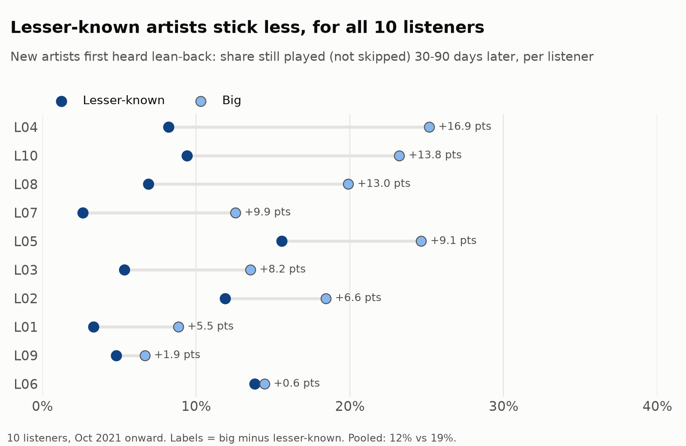
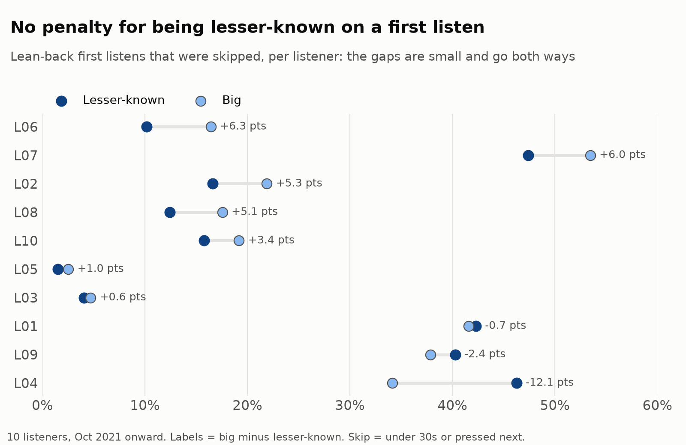
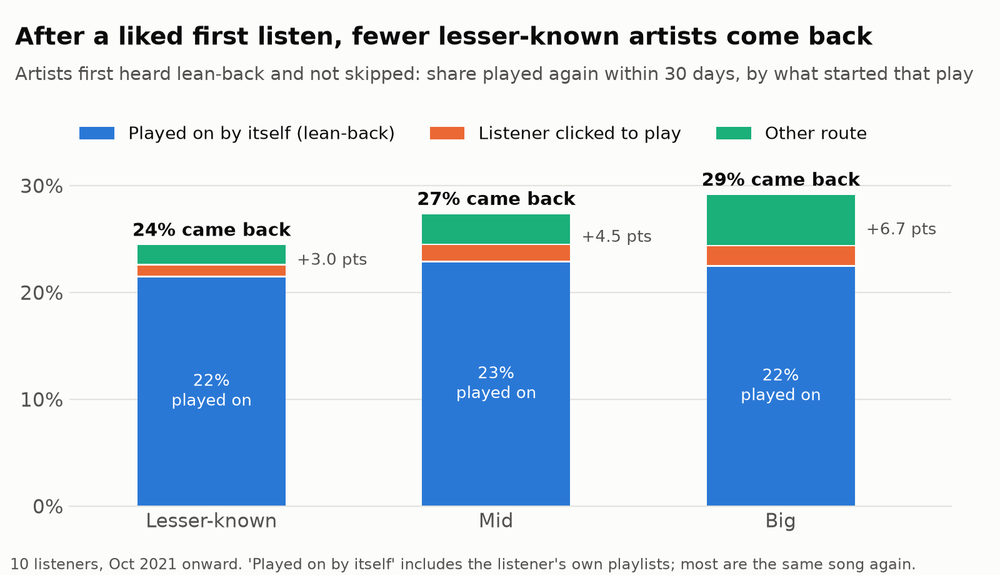
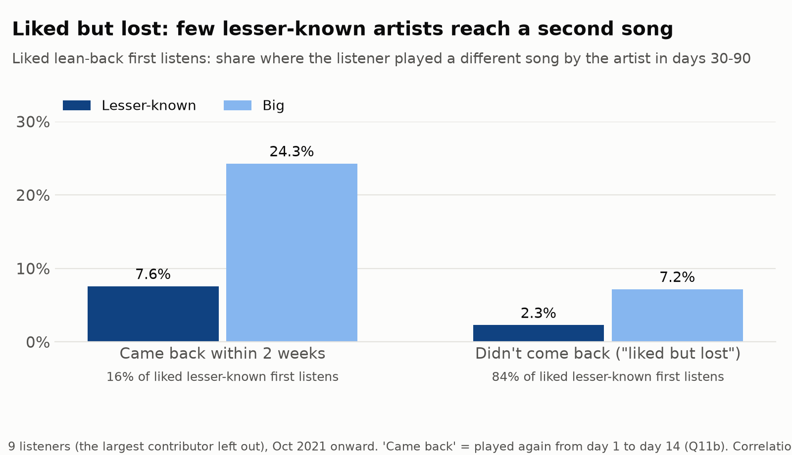
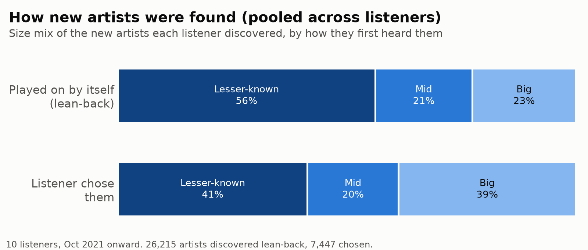

# Discovery Gap: do lesser-known artists get a fair chance on Spotify?

*A product case study by Ena · [Read it as an interactive website](https://helena-byte999.github.io/discovery-gap/). Independent, not affiliated with Spotify. Listening data from 10 friends' Spotify exports, shared with consent; four were also interviewed. Artist data from Last.fm and Deezer.*

| | |
|---|---|
| **Role** | Solo: scoping, data collection, SQL analysis, interviews, recommendation |
| **Data** | 1.68M plays from 10 Spotify Extended Streaming History exports, 4 interviews, 30 artists checked by hand against Spotify |
| **Methods** | SQL (MySQL), within-listener comparisons and a listener-level bootstrap, interview synthesis, experiment sizing |

---

## TL;DR

**Lesser-known artists get a fair first listen on Spotify. What they don't get is a lasting place in people's listening, and today the second chance depends mostly on luck.**

- **Fair first listen.** There's no sign lesser-known artists are skipped more when they first come up. Within each listener the difference is small, and if anything goes their way.
- **They don't stick.** For **all 10 listeners**, fewer lesser-known artists were still being played 30–90 days after the first listen. That's 9 points fewer for the typical listener (12% vs 19% pooled).
- **The second chance is luck.** After a first listen the listener *liked* (didn't skip), most artists of any size aren't heard again within two weeks: 84% of lesser-known and 80% of big ones. The difference is what happens next. In days 30–90, a *different song* gets played for only 2.3% of these lesser-known artists, against 7.1% of big ones. Listeners rarely go back on their own: they click back to a new artist after just 1–2% of liked first listens. *(Figures leave out the one listener who dominates this group; see Finding 3.)*

**Proposal: "Second Listen."** When a liked lesser-known artist hasn't come back after two weeks, bring them back once, with a **different** song, in the radio, autoplay or mix where the listener first heard them. Test it with an A/B experiment. The primary metric is whether the listener plays another song by that artist in days 30–90, not counting the re-introduced song.

---

## 1. The problem and why it matters

Spotify is a two-sided marketplace: music listeners will love, and listeners for artists. For a lesser-known artist, a first play is only a start. What counts is the listener coming back:

- **For artists:** since April 2024, a track needs 1,000 streams in 12 months, from a minimum number of unique listeners, to earn recording royalties ([Spotify](https://support.spotify.com/us/artists/article/track-monetization-eligibility/)). Returning listeners get an artist there. One-off listens don't.
- **For listeners:** two of the four interviewees said Spotify rarely shows them small artists. Yet it does introduce them (appendix A2). What listeners don't get is the follow-up, so those introductions are never remembered as finds.
- **For Spotify:** it invests in lesser-known discovery. More than 1 in 10 artists earning $100,000+ a year were first playlisted in its Fresh Finds programme ([Loud & Clear 2026](https://newsroom.spotify.com/2026-03-11/loud-and-clear-music-economics-highlights/)). An introduction that goes nowhere wastes that work. Because royalties are pro-rata, extra streams for lesser-known artists mostly *redistribute* the pool rather than grow it. So the value to Spotify is retention and ecosystem health (engaged listeners, artists who stay), not new royalty revenue.

**What already exists after a first listen:**

| Tool | What it does | What it leaves out |
|---|---|---|
| Radio, autoplay, Daily Mix | May replay artists that fit the listener's taste | No public feature built around "liked once, then lost". In this data, returns are mostly the *same song* replaying. |
| Release Radar, Following feed | New releases from followed or frequently played artists | Nothing unless the artist releases something new *and* the listener follows or plays them often |
| **Paid display campaigns** | Artists can pay to reach "programmed listeners": people who've only streamed them from playlists, radio or autoplay, with no active streams in 2 years ([Spotify](https://support.spotify.com/us/artists/article/marquee-targeting/)) | Paid, so only artists with a budget benefit. A two-year window, not the weeks just after a liked first listen. |
| **Discovery Mode** | Artists accept a 30% commission ([Spotify](https://support.spotify.com/us/artists/article/using-discovery-mode-in-spotify-for-artists/)) on streams from radio, autoplay and Mixes ([overview](https://www.thatericalper.com/2026/07/15/discovery-mode-on-spotify-should-artists-actually-use-it/)) in return for more placement there | Works on the *first* exposure |

Spotify already sells artists a way to reach listeners who met them passively. That shows reaching these listeners is valued. No public feature does this *organically*, for every lesser-known artist, in the two weeks after a liked first listen.

## 2. What I expected, and what I found

I expected **popularity bias**: big artists pushed harder, and lesser-known ones skipped more. The data pointed somewhere else.

| Hypothesis | Result |
|---|---|
| H1: a lesser-known artist's first listen is skipped **more** | **Not supported.** Small differences within each listener, and they don't go one way (Finding 1) |
| H2: Spotify's lean-back introductions lean towards **big** artists | **Not supported.** Similar mix to what listeners pick themselves (appendix A2) |
| H3: lesser-known artists **stick less** after a first listen | **Supported,** for 10 of 10 listeners (Finding 2) |
| H4: listeners go back on their own to new artists they liked | **Rarely, as far as the export shows.** Clicks back are 1–2%. Returns through their own saved playlists can't be separated. (Finding 3) |

The question changed from "is discovery unfair?" to "why does a fair introduction lead nowhere?"

## 3. Findings

*How it was measured (skips, "lean-back", artist size, uncertainty) is in the appendix. "Lean-back" means a play that carried on by itself (playlist, album, radio or autoplay), so it includes the listener's own playlists as well as Spotify's.*

### Finding 1: no penalty for being lesser-known on a first listen

- **Pooled:** lean-back first listens of lesser-known artists are skipped 7.9% of the time, against 17.8% for big artists.
- **That gap is mostly about *who* listens, not the artists.** The listeners who skip least also play the most lesser-known artists. One heavy background listener supplies over half of these lean-back first listens, at a 1.5% skip rate. Adding everyone's plays together creates a gap bigger than any single listener's (the largest is 6.3 points).
- **Within each listener:** the gap is a median of **2 points** in lesser-known artists' favour. 7 of 10 listeners show it, 3 show the opposite, and it isn't statistically significant (sign test p = 0.34).
- **So the fair reading is "no penalty", not "an advantage".** The interviews say the same thing: all four said a small listener count doesn't put them off. One said a low count "would even give me more reason to go". Another, asked whether they check an artist's monthly listener count, said: "I don't equate quality music to more famous songs."

### Finding 2: lesser-known artists stick less, for every listener

- **Stuck:** still played (not skipped) 30–90 days after a lean-back first listen.
  - 12% of lesser-known artists stuck, against 19% of big artists.
  - Within each listener the gap is a median of **8.8 points**. **10 of 10** listeners show it (p = 0.002).
  - Leaving out any one listener keeps it between 5.9 and 9.3 points.
- **This is the most robust result in the project, and the headline.**

### Finding 3: the second chance is luck, and it's usually the same song

This finding looks only at first listens the listener *liked*: lean-back and not skipped.

- **Fewer lesser-known artists come back within 30 days:** 24% vs 29% pooled. Within each listener, the median gap is 5.7 points, and 8 of 9 listeners show it (1 level, p = 0.04).
- **The listener rarely goes looking.** A click back happens after just 1.0% of liked lesser-known first listens (1.9% for big), about 1 in 25 of the returns.
- **Most returns are the same song replaying.** 17.4 of the 21.5 points of lean-back returns are the same song: a playlist replaying it, Spotify's or the listener's own. Returns that play on by themselves also lean towards big artists within listeners (8 of 10, median 5 points, though not significant: p = 0.11).
- **Even when lesser-known artists come back, the return rarely leads further.** Only 7.5% of those that came back within two weeks got a *different* song played in days 30–90, against 24% of big artists (without the largest contributor).
- **The interviewees rely on their own routines to go back:** relistening new songs the next day, Shazam and bookmarked playlists, an artist's first few popular songs, following up something first heard on TikTok or YouTube. Keen listeners do this for a few artists. The data suggests most liked artists never get it.

### The liked-but-lost group: the size of the gap

Without the largest contributor, whose background listening makes "liked" unreliable:
- **84%** of liked lesser-known artists aren't heard again within two weeks, against 80% of big artists.
- In days 30–90, only **2.3%** of those lesser-known artists get a different song played, against 7.1% of big artists in the same position.
- The gap holds within all 10 listeners (median 5 points, p = 0.002).
- **Under the proposed trigger rules** (played to the end; a tagged, non-functional artist) the baseline is **3.3%** vs 7.1%.

**Catalogue size may explain part of this.** Many lesser-known artists have only a few songs to find. Limiting to artists with 3+ songs in the data closes the gap (8.7% vs 8.9%). That filter is biased, though, because for tiny artists the other songs seen are often the listener's own returns (Q13). So the trigger requires artists with several released songs, and the true baseline has to be measured in Spotify's data.

For big artists, other routes seem to fill in: listener clicks and "other" starts are more common (Finding 3), and some of this probably comes from off-platform exposure (radio, TikTok, friends), which the export can't show.

**This is correlation, not proof.** Artists that come back may simply be the ones listeners liked more. Whether *causing* a return leads to a second song is what the experiment has to show.

## 4. Options considered

| Option | Acts on | Impact | Confidence | Effort | Decision |
|---|---|---|---|---|---|
| **A. Re-introduce liked-but-lost lesser-known artists with a different song, in radio/autoplay/mixes** | The gap (Findings 2–3) | High | Medium: strong in the data and interviews, untested causally | Medium: a new ranking signal, no new UI | **Build and test** |
| B. More lesser-known artists in first exposure (Fresh Finds, Discovery Mode) | The first listen | Low | Low: the first listen is already fair | Low | No: more introductions, same leak |
| C. Hide monthly listener counts | The first listen | Low | Low: interviewees already ignore them | Low | No |
| D. Genre tags on tracks | The first listen | Low | Low: 1 of 4 interviewees wanted them | Medium | No |
| E. Album-based mixes instead of artist radio | Relevance in general | Medium | Medium | High | Backlog: not specific to lesser-known artists |
| F. "Follow this artist?" prompt after a liked listen | The gap | Low | Low: it asks the listener to act, and clicks back are rare | Low | No |

## 5. The proposal: "Second Listen"

**Trigger**
- A lean-back first listen of a lesser-known artist that played to the end.
- No play of that artist in the next 14 days.
- **Excluded:**
  - sleep and background contexts, such as sleep timers and functional playlists
  - Discovery Mode placements
  - artists without a verified profile, or with only one or two released songs

**What happens (v1, no new screens)**
- The artist gets one ranking boost, with a **different** song, in the radio, autoplay or mix where the listener first heard them.
- The first listen happened in that surface, so a return there feels natural.

**Limits**
- One re-introduction per artist, and at most 2 a week per listener.
- Listeners who rarely try new artists get fewer or none. One interviewee who calls himself a loyal listener said that after a popular song he wants "another popular" one. That was in answer to my question about popularity bias, so it counts as a lead, not evidence.
- "Hide" and "not interested" remove the artist from re-introductions.

**v2, if v1 works**
- Add a reason line, such as "You listened to X two weeks ago", or a familiar anchor ("with Y").
- Test it in Discover Weekly.
- One interviewee said that if a new artist is presented as similar to one he loves, "at the very least, I'm likely to click on it". That was in answer to an example I gave, so it counts as a lead, not evidence.

**Who needs to agree:**
- The personalisation teams for radio, autoplay and mixes
- The artist-tools team: this sits next to the paid display campaigns
- Trust & safety: gaming and spam
- Legal: anything near promotion

## 6. How to measure it

| Type | Metric |
|---|---|
| **Primary** | Of triggered artists, the share where the listener plays (not skips) a **different song** by the artist in days 30–90. The re-introduced song doesn't count, and neither does the song that *would* have been used in control. Baseline 3.3% under the trigger rules. |
| **Secondary** | Any play in days 30–90; saves and follows; new artists added to a listener's regular rotation |
| **Leading** (30 days) | Something the re-introduction can't produce by itself: a return the listener starts, a save, or a follow. In this data, artists that come back early are far more likely to last. |
| **Guardrails** | Listening time per session (no drop beyond a pre-agreed margin, e.g. 0.5%); skip rate on re-introduced tracks (no higher than the surface's normal rate); hide rate. All reported separately for loyal listeners. |
| **Counter-metric** | Primary-metric rate for *other* artists in the same surfaces, to check for crowding out |

**Experiment design**
- **Randomisation:** by listener, 50/50.
- **Ghost triggers:** control logs "would have triggered", so triggered artists can be compared across arms.
- **Analysis:** intention-to-treat, with listener-clustered standard errors.
- **Size:** it depends on how many re-introductions are actually heard and on the lift.
  - About **490 listeners per arm** if 70% are heard and the primary metric doubles.
  - About **33,000 per arm** if 30% are heard and the lift is 25%.
  - Either is small for Spotify ([`sizing.py`](sizing.py); design effect from unequal volumes per listener, planned intra-class correlation 0.02).
- **Duration:** one month of enrolment plus a **90-day** readout. The readout, not traffic, is what sets the timeline.
- **Decision rule, set before launch:**
  - **Ship** if the primary metric rises and no guardrail breaks its margin.
  - **Iterate on timing or song choice** if the leading metric moves but the primary doesn't.
  - **Stop** if the skip rate on re-introductions exceeds the surface's normal rate.

## 7. Is it worth it?

- **Illustrative scale:** for every 1 million listeners like the median one in this sample, Second Listen would add roughly **3,000 to 28,000** more listener–artist connections a month that reach a second song. The low case is 30% of re-introductions heard with a 25% lift; the high case is 70% with a doubling.
- **These are units, not a forecast.**
  - The sample is heavy listeners. The median one "loses" about 5 lesser-known artists a month, and about 1 a month meets the trigger rules.
  - A typical Spotify user probably loses fewer, so the real total depends on Spotify's own trigger volumes. The offline replay (section 9) measures those first.

## 8. Risks

- **Annoyance and crowding out:** one try per artist, a weekly cap, the guardrails and the counter-metric.
- **Loyal listeners:** handled by segmenting them and reporting them separately.
- **Gaming and spam:** in this data, most lesser-known first listens are of untagged, very small artists, which could include stock or spam acts. That's why v1 requires verified profiles, a full lean-back listen, excluded functional contexts, and existing stream-fraud checks.
- **Paid products:** a free organic nudge could reduce demand for paid campaigns. Keep it narrow (once, two weeks after a liked listen), and consider showing artists their "liked but lost" numbers in Spotify for Artists. That's value for artists, and a natural path to paid campaigns.
- **Trust:** personalised reasons ("you listened to…") can feel intrusive, and promotion on streaming services is under scrutiny: a 2025 class action challenges how Discovery Mode is disclosed ([Digital Music News](https://www.digitalmusicnews.com/2025/11/05/spotify-accused-of-payola-in-class-action-lawsuit/)). v1 has no reason line and no paid placements.

## 9. Rollout

1. **Offline replay on Spotify's data:**
   - measure trigger volumes and the baseline for typical listeners
   - separate autoplay from the listener's own playlists, which the export can't do
   - check that a 30-day second listen predicts the 90-day outcome
2. **The A/B test** in radio and autoplay.
3. **Expand** to mixes, then test the v2 reason line and the timing (1, 2 or 4 weeks; 2 is a guess).

## 10. Limits and reflection

**Limits**
- **The sample:** 10 friends, mostly heavy listeners in Nigeria and the UK. One listener has 27% of the plays; another supplies over half the lesser-known lean-back first listens.
  - This is why every finding is shown within each listener as well as pooled.
  - The ranges describe variation among listeners like these, not Spotify's users.
- **Proxies:**
  - "Lean-back" mixes Spotify's surfaces with the listener's own playlists.
  - "Liked" means not skipped.
  - A "first listen" is the first *in this export*. Big artists may have been heard before the export started, or elsewhere.
- **Observational data:** it can't see recommendations that were shown but not played, or discovery off Spotify.

**Reflection**
- **The most useful moment was the hypothesis failing.** I set out to show popularity bias at the first listen. Following the data to what happens *after* gave a sharper and more buildable problem.
- **A pooled number nearly misled me.** My first draft headlined "lesser-known artists are skipped less: 7.9% vs 17.8%". A peer review showed that gap mostly reflects *who* listens. Since then, every comparison is within listeners first.
- **Measurement took most of the time, and it mattered.** A single global size cut-off would have called almost every African artist "lesser-known". Checking against Spotify by hand fixed that.
- **Interviews need neutral questions.** In some calls I brought up "popularity bias" myself, so those answers aren't used as evidence. Next time I'd script the questions to avoid leading.

---

## Appendix

### A1. Data and method

**Data**
- 10 friends' full Spotify exports, about 1.68M plays.
- The analysis uses the 1.44M plays since October 2021, the personalised-mix era.
- Podcasts are dropped, IP addresses are never loaded, and friends appear by code only.

**Definitions**
- **Skip:** under 30 seconds (Spotify's stream threshold), or ended with "next".
- **Lean-back:** the play started by carrying on from the previous track.
- **Chosen:** the listener clicked or pressed play. This includes tapping a song inside one of Spotify's mixes.
- **First listen:** a listener's first play of an artist in their whole export, after a 30-day warm-up.
- **Liked:** a lean-back first listen that wasn't skipped.
- **Lost:** no play of the artist from day 1 to day 14.
- **Stuck:** played, not skipped, in days 30–90.

**Artist size: ranked within the artist's own genre** (Last.fm listeners)
- The bottom third of each genre is lesser-known and the top third is big.
- A single cut-off doesn't work. Last.fm's audience leans Western, so under 100k/1M cut-offs 357 of 412 Afrobeats artists came out lesser-known and only 2 big. Burna Boy, Wizkid and Davido were all mid, and the amapiano star Kabza De Small came out "small" (Q12).
- I checked 30 artists by hand against Spotify monthly listeners ([`spotify_check.csv`](spotify_check.csv), [`check_size_measure.py`](check_size_measure.py)). Last.fm undercounts African artists by about 3.5× compared with Western ones, but it still *orders* artists correctly within each group (rank correlation 0.91).
- **Disclosure:** 71% of lesser-known lean-back first listens are artists with no genre tag. They fall back to the fixed cut-off (under 100k Last.fm listeners), and almost all of them are very small. Among tagged artists only, the pooled first-listen skip is 9.6% vs 17.8%.
- Two other measures give the same direction: fixed Last.fm cut-offs and Deezer fans (Q10).

**Uncertainty** ([`bootstrap_ci.py`](bootstrap_ci.py))
- Every gap is given two ways:
  - **pooled**, with a listener-level bootstrap range (10,000 resamples of the 10 listeners)
  - **within each listener**: mean and median of per-listener gaps, how many listeners show it, and an exact sign test
- A leave-one-out check and a figure without the largest contributor are also reported.

### A2. How new artists reach people

- **Pooled:** 67% of lesser-known first listens are lean-back, against 44% for big artists (Q2b).
- **Size mix of new artists:** 56% of those introduced lean-back are lesser-known, against 41% of those people chose.
- **Within listeners, both differences shrink.** The route-share gap is a median of 3 points (7 of 10 listeners, range −12 to +11). The size-mix gap splits 5 listeners one way, 4 the other and 1 level (mean −0.8 points).
- **Conclusion:** no sign that lean-back introductions favour big artists, and no reliable sign that they favour lesser-known ones.

### A3. Key numbers

| Measure | Pooled (95% range) | Within listeners: median gap, listeners showing it |
|---|---|---|
| First-listen skip, lesser-known vs big | 7.9% vs 17.8% (gap 3.8–14.0) | 2.0 pts; 7 of 10; p = 0.34 |
| Stuck 30–90 days | 11.9% vs 19.0% (gap 4.4–11.3) | 8.8 pts; 10 of 10; p = 0.002 |
| Back within 30 days after a liked listen | 24.4% vs 29.3% (gap 2.4–8.8) | 5.7 pts; 8 of 9, 1 level; p = 0.04 |
| Listener clicked back | 1.0% vs 1.9% | |
| Liked but lost → different song, days 30–90 (without the largest contributor) | 2.3% vs 7.1% | 5.0 pts; 10 of 10; p = 0.002 |
| …under the trigger rules | 3.3% vs 7.1% | |

*All queries: [`04_analysis.sql`](04_analysis.sql) (Q0–Q11c) and [`05_listener_counts.sql`](05_listener_counts.sql). Method and rerun steps: [`README.md`](README.md).*

**Sources**
- [Spotify for Artists: track monetization eligibility](https://support.spotify.com/us/artists/article/track-monetization-eligibility/)
- [Spotify for Artists: using Discovery Mode](https://support.spotify.com/us/artists/article/using-discovery-mode-in-spotify-for-artists/)
- [Spotify for Artists: campaign audience targeting](https://support.spotify.com/us/artists/article/marquee-targeting/)
- [That Eric Alper: Discovery Mode on Spotify (July 2026)](https://www.thatericalper.com/2026/07/15/discovery-mode-on-spotify-should-artists-actually-use-it/)
- [Spotify Newsroom: Loud & Clear 2026 highlights](https://newsroom.spotify.com/2026-03-11/loud-and-clear-music-economics-highlights/)
- [Digital Music News: class action over Discovery Mode (Nov 2025)](https://www.digitalmusicnews.com/2025/11/05/spotify-accused-of-payola-in-class-action-lawsuit/)
